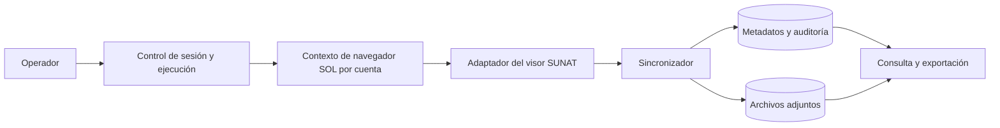
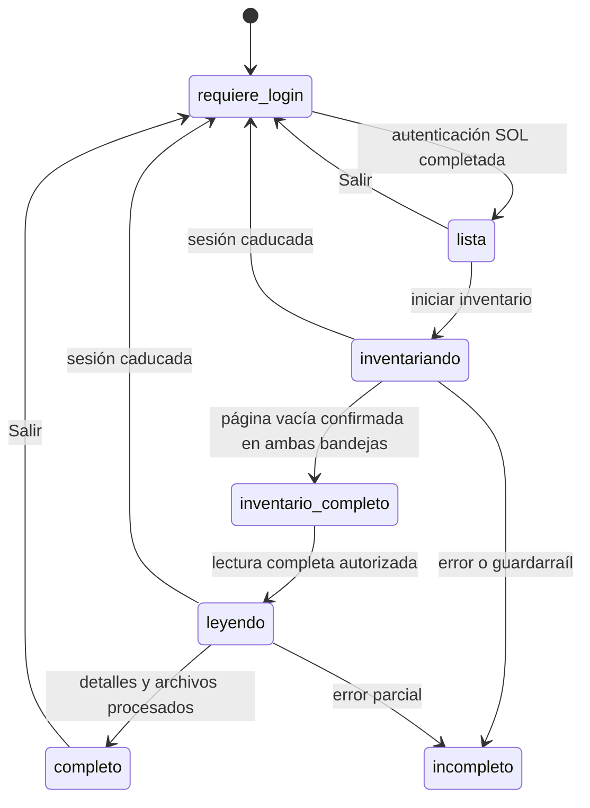

# SDD · Diseño del lector de Buzón SOL

> **Alcance histórico (v1):** arquitectura de lector supervisado. Para la arquitectura de aplicación multiusuario y programador, ver [spec backend](../backend/spec.md). Conservar de aquí el algoritmo de paginación y las precauciones de lectura/descarga sustentadas por [contracts.md](../sunat/contracts.md).

Implementación de referencia para [requirements.md](requirements.md), basada en [contracts.md](../sunat/contracts.md). El diseño evita fijar un framework web o un proveedor de base de datos. La primera versión puede ser un proceso local con Playwright, una base SQLite y un directorio de adjuntos. No necesita cola distribuida ni microservicios para cumplir los requisitos observados.

## 1. Componentes mínimos



| Componente | Responsabilidad | Límite |
|---|---|---|
| Control de sesión | Abrir login, esperar autenticación, detectar vencimiento, cerrar mediante «Salir». | No recibe ni registra la contraseña. |
| Contexto de navegador | Mantener cookies, `iframe`, encabezados y estado de una cuenta. | Nunca se comparte entre cuentas. |
| Adaptador del visor | Solicitar y validar listados, detalles, carpetas, documento HTML y descargas conforme al contrato. | No decide qué mensajes abrir. |
| Sincronizador | Recorrer páginas, deduplicar, decidir modo Inventario/Lectura completa, reintentar y registrar resultados. | No fabrica URLs de login ni tokens. |
| Almacenamiento | Persistir manifiesto, contenido y archivos con claves estables. | No almacena credenciales ni secretos de sesión. |

La petición de listado y detalle se ejecuta desde el contexto autenticado del `iframe` del visor o mediante las acciones equivalentes del navegador. Una petición HTTP hecha desde un cliente externo no se considera implementada hasta demostrar un mecanismo de autenticación soportado. Limitar destinos de red del adaptador a los orígenes SUNAT observados; las redirecciones inesperadas requieren revisión.

## 2. Modos y efecto sobre el buzón

### Inventario, modo inicial

1. Confirmar cuenta activa.
2. Consultar Notificaciones y Mensajes con `tipoOrden=NADA`.
3. Persistir metadatos y estado remoto `indEstado`.
4. Consultar carpetas y catálogo de etiquetas si están disponibles.
5. Producir un resumen sin pedir detalles, generar documentos ni descargar archivos.

Las llamadas de listado permiten detectar no leídos sin marcarlos como leídos. **El arranque de la web observada sí pidió automáticamente el detalle del primer registro.** El control de sesión debe impedir esa petición durante Inventario, por ejemplo mediante una regla de navegación probada antes de cargar el visor, o demostrar en una cuenta de prueba que el arranque no cambia un no leído. Hasta entonces, el producto no puede afirmar que entrar al buzón sea pasivo; debe mostrar esa limitación en el resultado.

### Lectura completa, acción explícita

1. Determinar la selección de registros y contar los que están no leídos según el último inventario.
2. Registrar una intención de lectura por registro **antes** de llamar a `obtenerDetalleNotiMen`.
3. Pedir detalle. Persistir `msjMensaje`, `listAttach`, `url`, `updateLeido` y el resultado bruto validado.
4. Si procede, pedir documento HTML y descargar cada adjunto.
5. Reconsultar estado del listado para los registros con `updateLeido=true`; no considerar fallida la lectura por una primera respuesta que aún indique `indEstado=0`.
6. Completar la intención de lectura con estado final: `contenido_guardado`, `contenido_parcial` o `fallo`. Conservar `estado_remoto_antes` y `estado_remoto_despues`.

El detalle puede tener un efecto irreversible desde esta interfaz: no se halló «Marcar como no leído». El sistema jamás presenta la lectura completa como operación de solo consulta.

## 3. Algoritmo de paginación

**Entrada:** cuenta, `tipoMsj`, carpeta/etiqueta opcional, `tipoOrden=NADA`.  
**Salida:** filas únicas, páginas recorridas y estado `completo` o `incompleto`.

```text
page := 1
seen := conjunto vacío
repetir:
    pedir listNotiMenPag(page)
    validar HTTP 200, Content-Type JSON, estructura rows[]
    si rows está vacío:
        repetir esa página una vez para confirmar el final
        si sigue vacía: terminar como completo
        si trae filas: procesarlas
    para cada fila:
        validar codMensaje y tipo
        upsert por (cuenta, tipoMsj, codMensaje)
        añadir al conjunto seen
    registrar número de página, tamaño, contadores declarados y nuevos IDs
    page := page + 1
    si page supera el guardarraíl configurado: terminar como incompleto
```

`records`, `total`, `startPage` y `endPage` se registran para diagnóstico, no deciden el final. El guardarraíl existe para detectar un servidor que nunca entregue página vacía; su valor es configuración operacional, no un límite fijo basado en los datos actuales. Una página vacía con HTML, error o JSON inválido **no** significa fin.

La paginación por número de página no proporciona una instantánea transaccional. Si llegan mensajes mientras se recorre, las filas pueden desplazarse. La clave natural evita duplicados; si se requiere exhaustividad estricta, repetir el barrido y comparar conjuntos hasta una pasada estable o reportar que no se alcanzó estabilidad. Los filtros por fecha se aplican al inventario persistido; no se corta un barrido por fecha porque no se probó orden cronológico estricto.

**Caso obligatorio de prueba:** `total=108`, `records=2681`, 133 páginas de 25 filas más una de 3, y la 135 vacía. El algoritmo debe persistir 3328 filas únicas y reportar la discrepancia sin truncar.

## 4. Contrato interno del adaptador

```text
openSession(account): AuthenticatedContext | NeedsLogin
listPage(context, tipoMsj, page, codCarpeta, codEtiqueta, subject, tipoOrden): Page
listFolders(context): Folder[]
getLabelCatalog(context): Label[]
getDetail(context, tipoMsj, codMensaje): Detail
getGeneratedHtml(context, detail.url): HtmlDocument
downloadAttachment(context, message, attachment): BinaryWithHeaders
logout(context): LogoutResult
```

Cada operación devuelve también `httpStatus`, tipo de contenido y diagnóstico redactado. El adaptador valida el esquema mínimo y conserva campos desconocidos en un JSON bruto para tolerar cambios aditivos. La lógica de negocio no accede directamente a cookies ni arma URLs con tokens.

`getLabelCatalog` extrae `listEtiquetas` de `/visor/master` o, si la web cambia, deja el catálogo como no disponible y conserva el código de cada fila. El catálogo conocido en [contracts.md](../sunat/contracts.md) sirve para comparar, no para descartar códigos nuevos.

## 5. Modelo lógico de datos

Las claves son lógicas y pueden implementarse con SQLite u otra base. El RUC se guarda como dato protegido; un `account_id` interno separa las cuentas en todas las tablas.

| Entidad | Clave / campos indispensables |
|---|---|
| `account` | `account_id` interno; RUC protegido; alias visible; fecha de alta. No hay contraseña. |
| `sync_run` | `run_id`, `account_id`, modo, inicio/fin, estado (`en_curso`, `completo`, `incompleto`, `requiere_reautenticacion`, `fallido`), conteos observados. |
| `sync_page` | `run_id`, `tipoMsj`, `page`, HTTP, filas, filas nuevas, `records`/`total` declarados, diagnóstico redactado. |
| `message` | `account_id`, `tipoMsj`, `codMensaje` (único compuesto), `desAsuntoRaw`, asunto mostrado, fechas raw, fecha local normalizada opcional y estado de su análisis, remitente, `codEtiqueta`, `codCarpeta`, `indEstado`, `indDesta`, `indUrg`, `cantidadArchAdj`, JSON de fila bruto, `firstSeenAt`, `lastSeenAt`. |
| `message_detail` | Clave del mensaje, `indTexto`, `msjMensajeRaw`, contenido normalizado, JSON anidado si aplica, `url` **redactada o protegida**, `updateLeido`, HTML generado si existe, JSON de detalle bruto protegido, `fetchedAt`. |
| `read_event` | Clave del mensaje, `run_id`, `estadoAntes`, `updateLeido`, `estadoDespues`, hora de cada observación, estado de procesamiento y error si ocurre. |
| `attachment` | ID interno, clave del mensaje, posición en `listAttach`, `codArchivo`, `numId`, nombre original, tamaño anunciado, MIME recibido, tamaño real, SHA-256, ruta interna, estado. |
| `folder` / `label` | Cuenta, código, nombre, color/cantidad observados, fecha de última observación. |

Índices mínimos: único en `message(account_id,tipoMsj,codMensaje)`; `message(account_id,tipoMsj,indEstado)`; índice en la fecha local normalizada solo si se consulta por rango con frecuencia; único lógico de adjunto por mensaje y posición de respuesta. No ordenar cadenas `DD/MM/AAAA` lexicográficamente para filtrar fechas. El número `codArchivo=0` **no** es identificador único global del archivo.

Guardar fecha raw siempre. Si se calcula una fecha normalizada, registrar la zona asumida y permitir corregirla; el servidor no la incluye explícitamente. `estado_local_procesamiento` nunca reemplaza `indEstado`.

## 6. Adjuntos y documento generado

Para cada detalle:

1. Separar entradas de `listAttach` por función observada; no confiar solo en `cantidadArchAdj`.
2. Si `url` está presente y pertenece al origen SUNAT esperado, obtener HTML generado en la misma sesión y guardar su resultado aparte del PDF.
3. Para archivos, usar la URL de descarga verificada y examinar el cuerpo antes de considerarlo válido. `Content-Type: text/html` o un cuerpo de login/error causa fallo de descarga.
4. Para `codArchivo=0`, mantener un bloqueo por cuenta desde la apertura del detalle hasta el fin de la descarga. No lanzar varias descargas de este tipo en paralelo.
5. Guardar bytes en archivo temporal dentro del almacén propio, calcular SHA-256 y mover atómicamente al nombre interno definitivo. Validar `Content-Disposition` sin usarlo como ruta.

No se presupone PDF en todos los casos: se observaron dos PDF, pero pueden aparecer otros tipos. Se registra el MIME real y el formato detectado; la interfaz de consulta decide cómo abrirlo.

## 7. Estados de ejecución y errores



Reglas de fallo:

- `401`/`403`, redirección a login o HTML de login donde se esperaba JSON: detener llamadas dependientes y solicitar nueva autenticación.
- Error de red o `5xx`: reintento acotado con espera creciente; al agotarse, dejar el run `incompleto`, no declarar fin de paginación.
- Esquema incompatible: conservar diagnóstico redactado y fallar explícitamente el adaptador.
- Descarga fallida: conservar el detalle y marcar solo el adjunto como pendiente o fallido.
- Detalle que pudo marcar como leído pero cuyo guardado falla: preservar `read_event` iniciado; al reintentar, no borrar el estado original previo a la llamada.

## 8. Privacidad y operación

- Contexto de navegador separado por cuenta; sin persistir perfiles autenticados salvo decisión de seguridad posterior.
- Redactar query `token`, `hc`, `state`, `datos`, valores de cookies y `Referer` antes de cualquier log o error compartible. No guardar trazas HAR completas sin tratamiento, porque pueden incluir credenciales y documentos.
- Separar permisos de archivos y metadatos por cuenta. Toda exportación requiere selección explícita de cuenta y destino.
- No interpretar ni ejecutar scripts del HTML de mensajes en la interfaz propia. Mostrar versión sanitizada y ofrecer el original como archivo de datos protegido si es necesario.
- `Salir` se ejecuta desde el menú observado; cerrar el navegador o borrar cookies localmente por sí solo no se considera validación de salida remota.

## 9. Observabilidad mínima

Un run informa: cuenta (alias, no RUC completo), modo, bandejas, páginas consultadas, filas recibidas, únicos, duplicados, no leídos observados, detalles solicitados, cambios de lectura observados, adjuntos exitosos/fallidos y discrepancia entre contadores declarados y reales. Las métricas no contienen asuntos, contenido ni nombres de archivos.
